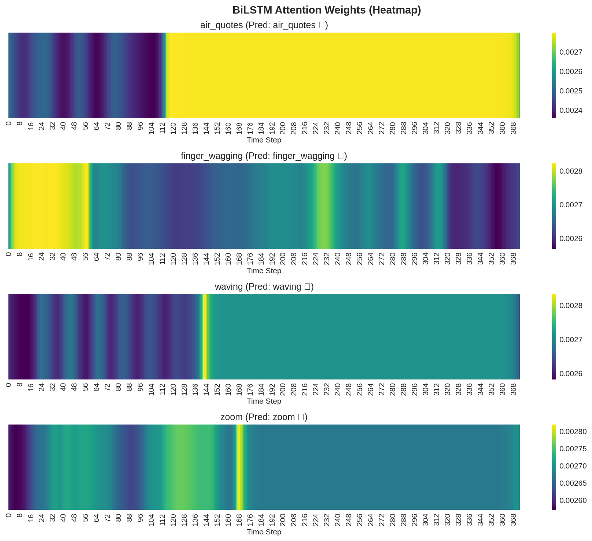
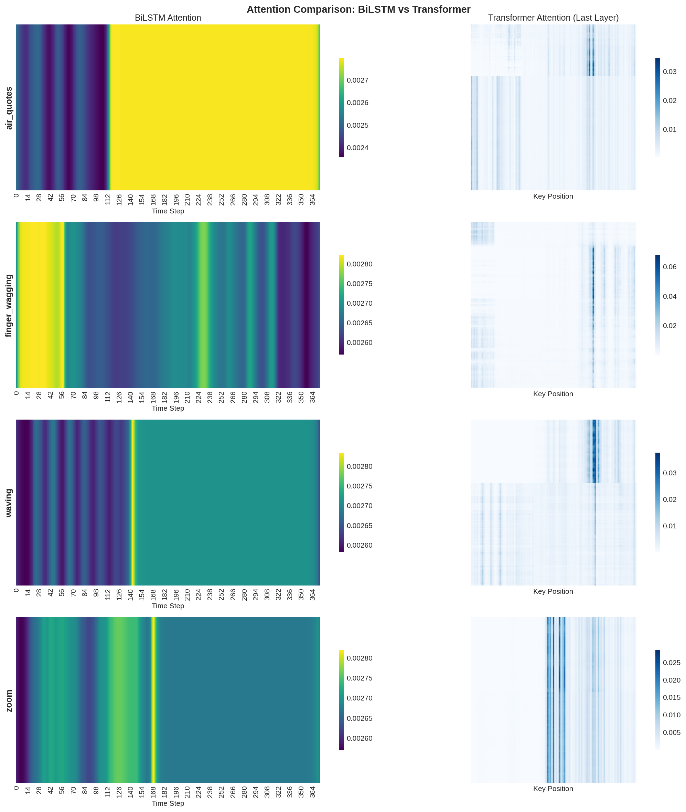

# DYLEM-GRID: Dynamic Hand Gesture Recognition

[](https://opensource.org/licenses/MIT)
[](https://www.python.org/downloads/)
[](https://lightning.ai/)
[](https://huggingface.co/datasets/LookUpMark/DYLEM-GRID)

State-of-the-art Dynamic Hand Gesture Recognition (D-HGR) using **BiLSTM with Attention** and **Transformer** architectures on the [DYLEM-GRID dataset](https://huggingface.co/datasets/LookUpMark/DYLEM-GRID).

This repository contains the official PyTorch Lightning implementation for the paper **"A Comparative Analysis of BiLSTM and Transformer Architectures for Dynamic Hand Gesture Recognition"**.

---

## 🚀 Key Features

*   **Modular Pipeline**: Built with [PyTorch Lightning](https://lightning.ai/) for scalable and reproducible training.
*   **Auto-Tuning**: Integrated [Optuna](https://optuna.org/) hyperparameter optimization.
*   **Robust Evaluation**: 5-Fold Stratified Cross-Validation protocol.
*   **Explainable AI**: Built-in visualization of attention mechanisms (Heatmaps).
*   **Reproducibility**: Automatic dataset download and seeded experiments.

## 📊 Models & Results

We benchmarked two architectures on the DYLEM-GRID dataset (400 samples, 4 gesture classes).

| Model | Architecture Highlights | Accuracy (5-Fold CV) |
| :--- | :--- | :--- |
| **BiLSTM** | Bidirectional LSTM + **Attention Mechanism** | **97.25% ± 0.94%** |
| Transformer | Encoder-only + Positional Encoding | 94.75% ± 0.94% |

**Key Finding**: The attention mechanism is crucial for BiLSTM, providing a +7% accuracy boost by allowing the model to focus on the active phase of the gesture.

## 👁️ Visualization

### BiLSTM Attention Heatmaps
The model effectively acts as a learned temporal filter, focusing on the core gesture motion and ignoring idle states.


### Comparison: BiLSTM vs Transformer


## 🛠️ Installation

```bash
git clone https://github.com/LookUpMark/dylem-grid.git
cd dylem-grid

# Create a virtual environment (recommended)
python -m venv venv
source venv/bin/activate  # on Windows: venv\Scripts\activate

# Install dependencies
pip install -r requirements.txt
```

## 💻 Usage

The project is organized into numbered notebooks for a clear workflow:

| # | Notebook | Description | Estimated Time |
| :--- | :--- | :--- | :--- |
| **01** | `01_optimization.ipynb` | Hyperparameter search using Optuna. | ~1 hour |
| **02** | `02_training.ipynb` | Train final models with best parameters (CV). | ~30 min |
| **03** | `03_inference.ipynb` | Evaluate models and generate confusion matrices. | ~2 min |
| **04** | `04_ablation.ipynb` | Run ablation studies (Attention, Layers, etc.). | ~2 hours |
| **05** | `05_attention_analysis.ipynb` | **[NEW]** Visualize attention heatmaps. | ~5 min |

To run the full pipeline, simply execute the notebooks in order.

### Python API
You can also use the components directly in your code:

```python
from src import GestureDataModule, BiLSTMModule

# Auto-download and prepare data
dm = GestureDataModule(batch_size=16)
dm.setup()

# Load specific model
model = BiLSTMModule(input_size=dm.input_size, hidden_size=64)
```

## 📂 Project Structure

```
dylem-grid/
├── notebooks/              # Jupyter notebooks for experiments
├── paper/                  # LaTeX source and figures
├── plots/                  # Generated plots
├── src/                    # Source code
│   ├── data/               # Data loading and preprocessing
│   ├── models/             # PyTorch Lightning modules
│   └── training/           # Training utilities
└── results/                # Logs and metrics
```

## 📜 Citation

If you use this code or dataset, please cite our work:

```bibtex
@misc{dylem2024,
  title={DYLEM-GRID---Dynamic Leap Motion Gesture Recognition Indexed Dataset},
  author={Sorce, M. and Lopez, M. A. and Trovato, G. and Cilia, N. D.},
  year={2024},
  publisher={HuggingFace},
  url={https://huggingface.co/datasets/LookUpMark/DYLEM-GRID}
}
```

## 📄 License

This project is licensed under the MIT License - see the [LICENSE](LICENSE) file for details.
