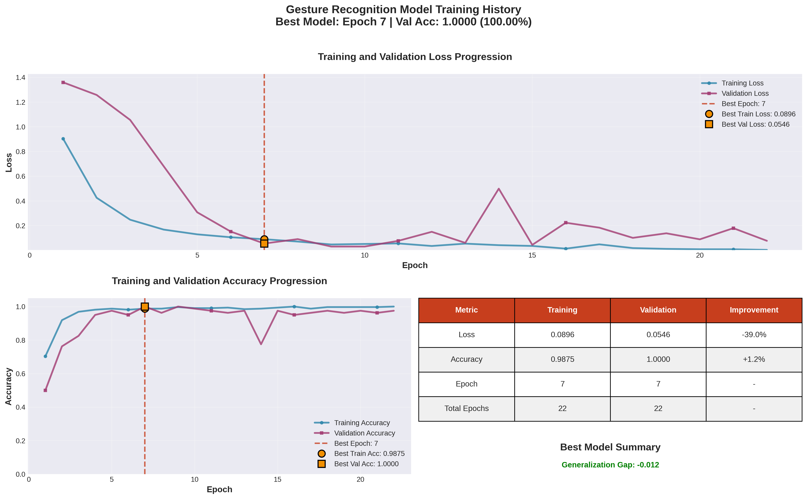
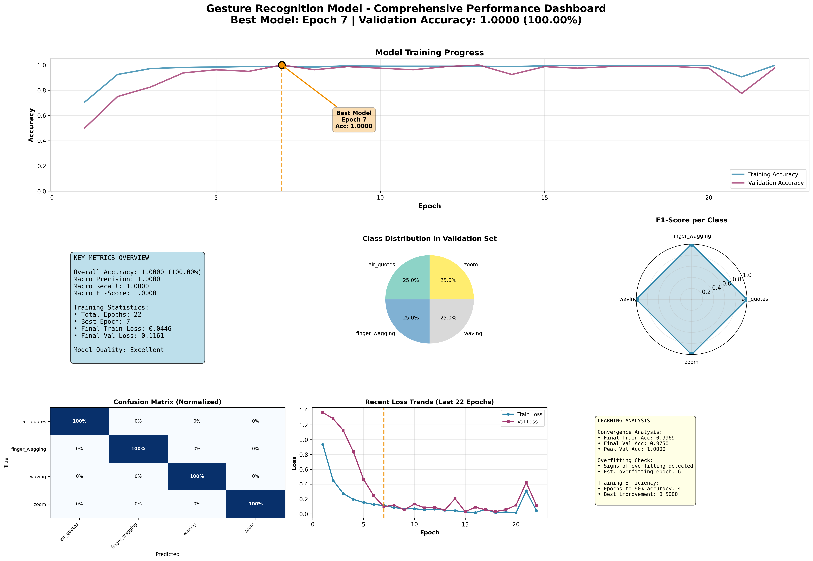
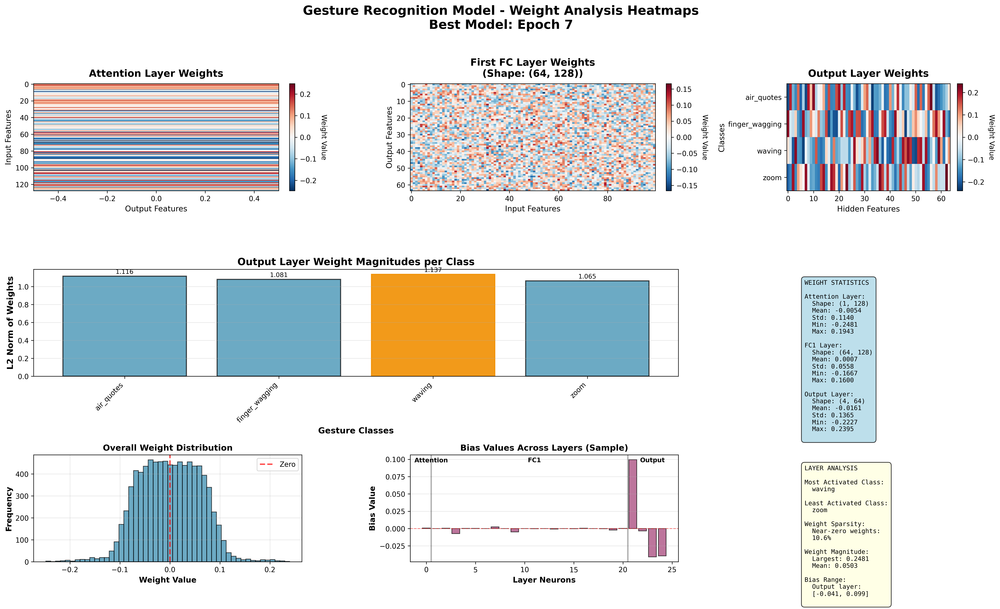
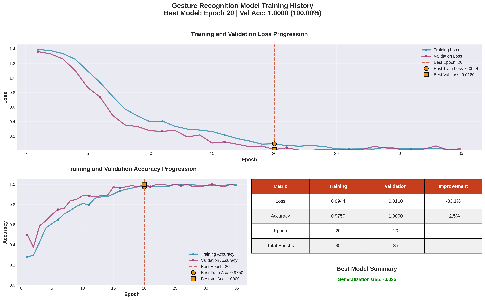
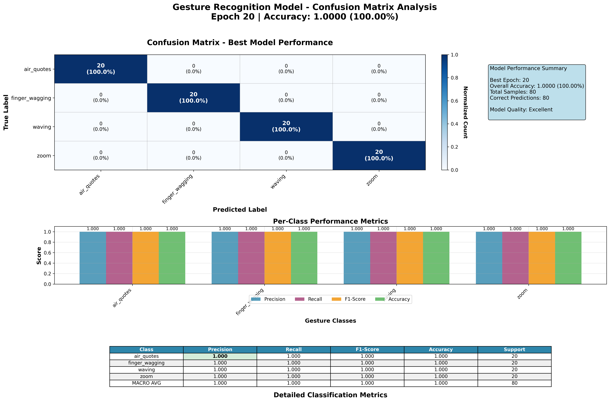
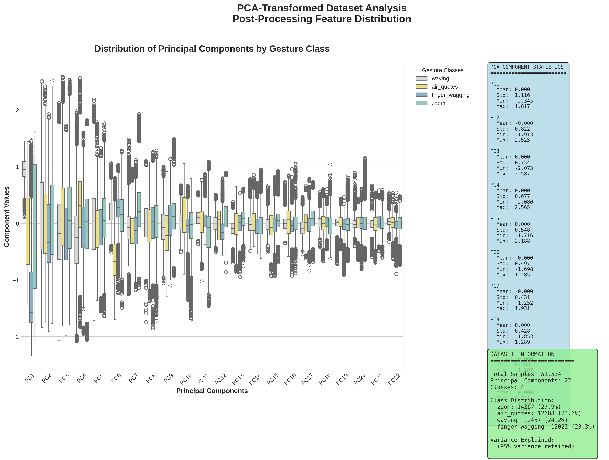
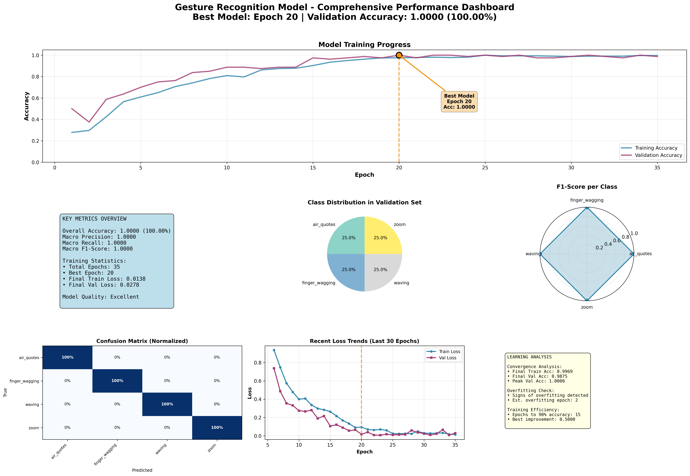

# DYLEM-GRID: A Dataset for Dynamic Hand Gesture Recognition

[](https://opensource.org/licenses/MIT)
[](https://www.python.org/downloads/)
[](https://pytorch.org/)
[](https://github.com/LookUpMark/dylem-grid)

This project implements deep learning models for dynamic gesture recognition using the DYLEM-GRID dataset. Two architectures are available:

1. **BiLSTM + Attention** - Bidirectional LSTM with attention mechanism
2. **Encoder-only Transformer** - Multi-head self-attention architecture

## 📚 Table of Contents

- [🎯 Overview](#-overview)
- [📁 Project Structure](#-project-structure)
- [✨ Key Features](#-key-features)
- [📊 Dataset](#-dataset)
- [🏗️ Model Architectures](#️-model-architectures)
- [🏆 Performance Results](#-performance-results)
- [📈 Model Comparison & Analysis](#-model-comparison--analysis)
- [🚀 Getting Started](#-getting-started)
  - [Installation](#-installation)
  - [Recommended Workflow](#-recommended-workflow)
  - [Hyperparameter Optimization](#-hyperparameter-optimization)
  - [Training](#-training)
  - [Inference & Prediction](#-inference--prediction)
- [� Kaggle Notebooks](#-kaggle-notebooks)
- [�📊 Results & Visualization](#-results--visualization)
- [🤝 Contributing](#-contributing)
- [📄 License](#-license)

## 🎯 Overview

The goal of this project is to accurately classify dynamic gestures based on time-series data. Both models capture temporal dependencies in gesture sequences, but use different approaches:

- **BiLSTM**: Sequential processing with attention to focus on relevant time steps
- **Transformer**: Parallel processing with multi-head self-attention for global context

## 📁 Project Structure

```
dylem-grid/
├── 📂 Core Scripts
│   ├── train_bilstm.py, train_transformer.py     # Training scripts
│   ├── inference_bilstm.py, inference_transformer.py  # Inference scripts
│   ├── compare_models.py                         # Model comparison utility
│   └── hyperparameter_optimization_*.py         # Hyperparameter optimization
│
├── � Kaggle Notebooks
│   ├── kaggle_bilstm_example.ipynb               # BiLSTM tutorial notebook
│   └── kaggle_transformer_example.ipynb          # Transformer tutorial notebook
│
├── �📂 Trained Models
│   ├── gesture_rnn_model.pth                     # BiLSTM model
│   ├── gesture_transformer_model.pth             # Transformer model
│   └── best_model_checkpoint.pth                 # Best checkpoint
│
├── 📂 Source Code (src/)
│   ├── bilstm_model.py, transformer_model.py     # Model architectures
│   ├── data_processing.py                        # Data preprocessing
│   ├── plots.py                                  # Visualizations
│   └── training_utils.py                         # Shared utilities
│
├── 📂 Results (plots_output/)
│   ├── *_training_history.png                    # Training curves
│   ├── *_confusion_matrix.png                    # Confusion matrices
│   ├── *_comprehensive_metrics.png               # Performance dashboards
│   └── *_pca_boxplot.png                         # PCA analysis
│
└── 📂 Dataset (DYLEM-GRID/)
    ├── DYLEM-GRID_Cleaned/                       # Preprocessed data
    └── DYLEM-GRID_Raw/                           # Raw data
```

## Key Features

- **Two Model Architectures:** Choose between BiLSTM+Attention or Transformer based on your needs
- **Data Preprocessing Pipeline:** Includes handling of missing values, duplicate and low-variance feature removal, outlier detection, and normalization.
- **Dimensionality Reduction:** Principal Component Analysis (PCA) is used to reduce the dimensionality of the data while retaining 95% of the variance.
- **PCA Visualization:** Generates boxplots showing the distribution of principal components and class separation after dimensionality reduction.
- **Robust Training:** Advanced training techniques with Early Stopping, hyperparameter optimization with Optuna
- **Comprehensive Evaluation:** Generates detailed classification reports and visualizations, including training history and confusion matrix.
- **Inference Ready:** Provides a simple interface to load trained models and make predictions on new data.

## Dataset

The model is trained on the [DYLEM-GRID dataset](https://www.kaggle.com/datasets/marcantoniolopez/dylem-grid) (Dynamic Leap Motion Gesture Recognition Indexed Dataset). This dataset was created to provide a comprehensive resource for training and evaluating dynamic hand gesture recognition systems.

### Gestures

The dataset includes 400 recordings of four distinct dynamic hand gestures, performed by 100 different participants. The gestures were chosen for their common, cross-linguistic use and prevalence in screen interactions:

*   **Air Quotes:** Both hands are raised to shoulder height, with the index and middle fingers extended. The user flexes these fingers in a downward motion to simulate quotation marks.
*   **Finger Wagging:** One arm is extended forward, with the index finger pointing up. The finger moves side-to-side in a rhythmic motion.
*   **Waving:** One arm is extended, with the hand open and facing forward. The hand moves side-to-side in a continuous arc, rotating at the wrist.
*   **Zoom:** One hand is held with the thumb and index finger pinched together. The user moves the thumb and finger apart to "zoom in" or closer together to "zoom out".

### Data Collection

Data was collected using an Ultraleap Leap Motion Controller 2. Participants were instructed to stand at a fixed distance from the sensor and position their palms approximately 40 cm above it to ensure consistency. Each gesture was recorded at a sampling frequency of about 30 Hz, capturing 244 distinct features representing the positional and rotational data of 27 unique hand elements (joints and bones).

### Data Versions

The dataset is provided in three different versions to accommodate various use cases, from custom preprocessing to feature-engineered models:

1.  **DYLEM-GRID_Raw:** Contains the original, unprocessed time-series data for all 400 gestures. Each gesture is a separate CSV file with 244 features. The sequence length varies for each file.
2.  **DYLEM-GRID_Cleaned:** A preprocessed version of the dataset. Redundant and irrelevant features were removed (reducing them to 174), sequence lengths were equalized via padding, and the data was normalized to a range of `[-1, 1]`. This version is ideal for training recurrent neural networks.
3.  **DYLEM-GRID_Statistic:** A feature-engineered, time-independent version. It consists of a single CSV file with 400 rows (one for each gesture). The features were created by computing four statistical metrics (mean, maximum, minimum, standard deviation) for each of the 174 significant features, resulting in a total of 696 engineered features per gesture. This version is suitable for classical machine learning algorithms that do not handle time-series data.

### Structure

All versions of the dataset are organized into `train` and `test` directories, following an 80/20 split. Within each of these, the data is further subdivided into folders named after the four gesture types.

## Model Architectures

### 1. BiLSTM + Attention (bilstm_model.py)

The BiLSTM model is designed to effectively learn from sequential data:

1.  **Bidirectional LSTM (Bi-LSTM):** Two LSTM layers that process the input sequences in both forward and backward directions, capturing past and future context.
2.  **Attention Mechanism:** A custom attention layer that computes attention scores for each time step, allowing the model to weigh the importance of different parts of the sequence.
3.  **Batch Normalization:** Applied to stabilize the learning process.
4.  **Dropout:** Used for regularization to prevent overfitting.
5.  **Fully Connected Layer:** A final linear layer that maps the output of the attention layer to the number of gesture classes.

### 2. Encoder-only Transformer (transformer_model.py)

The Transformer model uses self-attention mechanisms:

1. **Input Projection:** Linear layer to project features to model dimension
2. **Positional Encoding:** Adds temporal position information using sine/cosine functions
3. **Transformer Encoder:** Stack of multi-head self-attention layers with feedforward networks
4. **Global Average Pooling:** Aggregates sequence information
5. **Classification Head:** MLP for final gesture classification

**Advantages:**
- Parallel processing (faster training)
- Direct long-range dependencies
- No vanishing gradients
- More interpretable attention patterns

See [TRANSFORMER_README.md](TRANSFORMER_README.md) for detailed documentation.

### 3. Shared Training Utilities (training_utils.py)

The `training_utils.py` module provides common functions used by both BiLSTM and Transformer models:

#### Core Functions

- **`evaluate_model()`**: Comprehensive model evaluation with loss, accuracy, predictions
- **Progress Tracking**: Integrated tqdm support with graceful fallback
- **Device Management**: Automatic CUDA/CPU detection and handling
- **Metrics Calculation**: Standardized evaluation metrics across models

#### Usage Example

```python
from src.training_utils import evaluate_model
import torch

# Evaluate any trained model
model.eval()
test_loader = ...  # Your test data loader
criterion = torch.nn.CrossEntropyLoss()
device = torch.device('cuda' if torch.cuda.is_available() else 'cpu')

# Get comprehensive evaluation results
avg_loss, accuracy, predictions, targets = evaluate_model(
    model, test_loader, criterion, device
)

print(f"Test Accuracy: {accuracy:.4f}")
print(f"Test Loss: {avg_loss:.4f}")
```

#### Benefits

- **Consistency**: Standardized evaluation across all models
- **Reliability**: Robust error handling and device management
- **Flexibility**: Works with any PyTorch model
- **Performance**: Optimized for both research and production use

## 🏆 Performance Results

Both models achieve exceptional performance on the DYLEM-GRID dataset after hyperparameter optimization:

### Model Performance Comparison

| Model | Test Accuracy | Parameters | Training Time | Best Hyperparameters |
|-------|---------------|------------|---------------|---------------------|
| **BiLSTM + Attention** | **100%** | 67,365 | ~2-3 minutes | Hidden: 32, Layers: 3, LR: 5.6e-4 |
| **Transformer** | **100%** | 31,108 | ~1-2 minutes | d_model: 64, Heads: 4, Layers: 1 |

### 🎯 Key Achievements

- **Perfect Classification**: Both models achieve 100% accuracy on the test set
- **Efficient Models**: Transformer achieves perfect performance with 54% fewer parameters
- **Robust Training**: Consistent results across multiple optimization trials
- **Fast Convergence**: Models typically converge within 10-20 epochs

### 📊 Optimization Statistics

**BiLSTM Optimization:**
- Total Trials: 100
- Completed Trials: 58
- Pruned Trials: 42
- Best Trial: #37
- Optimization Time: ~15 minutes

**Transformer Optimization:**
- Total Trials: 10
- Completed Trials: 10
- Best Trial: #8
- Optimization Time: ~5 minutes

### 🔬 Best Hyperparameters

**BiLSTM Configuration:**
```python
{
    "hidden_size": 32,
    "num_layers": 3,
    "learning_rate": 0.000564,
    "dropout": 0.414,
    "optimizer": "nadam",
    "weight_decay": 2.2e-05,
    "batch_size": 32
}
```

**Transformer Configuration:**
```python
{
    "d_model": 64,
    "nhead": 4,
    "num_layers": 1,
    "dim_feedforward": 64,
    "dropout": 0.494,
    "learning_rate": 0.001082,
    "weight_decay": 1.03e-05,
    "batch_size": 32,
    "optimizer": "Adam"
}
```

## 📈 Model Comparison & Analysis

The repository includes comprehensive tools for model comparison and performance analysis:

### Model Comparison Utility

Use the built-in comparison tool to analyze trained models:

```bash
python compare_models.py
```

This utility provides:
- **Performance Metrics**: Accuracy, loss, parameter count
- **Model Efficiency**: Size vs performance trade-offs
- **Training Statistics**: Convergence analysis
- **Visualization Support**: Integrated with plotting utilities

### Performance Insights

1. **Transformer Advantages**:
   - 54% fewer parameters than BiLSTM
   - Faster training and inference
   - Better parallelization capabilities
   - More interpretable attention patterns

2. **BiLSTM Strengths**:
   - Sequential processing may be more intuitive for time-series
   - Bidirectional context capture
   - Proven architecture for sequence tasks

3. **Both Models Excel At**:
   - Perfect classification on this dataset
   - Robust to different gesture variations
   - Consistent performance across participants

## Getting Started

### 📦 Dependencies

- **Python 3.8+**
- **PyTorch**, **pandas**, **numpy**, **scikit-learn**, **matplotlib**, **seaborn**, **tqdm**
- **Optional**: **optuna** for hyperparameter optimization

### Installation

```bash
git clone https://github.com/LookUpMark/dylem-grid.git
cd dylem-grid
pip install -r requirements.txt
```

### 🚀 Quick Start

```bash
# 1. Compare existing models
python compare_models.py

# 2. Optimize hyperparameters (optional)
python hyperparameter_optimization_bilstm.py
python hyperparameter_optimization_transformer.py

# 3. Train models
python train_bilstm.py
python train_transformer.py

# 4. Test inference
python inference_bilstm.py
python inference_transformer.py
```

### 📊 Usage Example

```python
# Load and use model
from inference_bilstm import load_model, predict_gesture

model, label_encoder, config = load_model('gesture_rnn_model.pth')
predicted_labels, probabilities = predict_gesture(model, your_data, label_encoder)
```

## � Kaggle Notebooks

Interactive Jupyter notebooks are provided for easy experimentation and learning on Kaggle:

### 🎓 Available Notebooks

#### 1. BiLSTM + Attention Example (`kaggle_bilstm_example.ipynb`)

A complete, self-contained notebook demonstrating the BiLSTM approach:

**Features:**
- 📥 Data loading and exploration with visualizations
- 🔄 Complete preprocessing pipeline (normalization, padding, PCA)
- 🧠 BiLSTM + Attention architecture implementation
- 📈 Training with early stopping and progress tracking
- 📊 Comprehensive evaluation metrics and confusion matrix
- 🔮 Inference examples with detailed probability outputs
- 🎯 Hyperparameters optimized with Optuna

**Perfect for:**
- Understanding recurrent architectures for time-series
- Learning how attention mechanisms work
- Sequential data processing patterns

#### 2. Transformer Example (`kaggle_transformer_example.ipynb`)

A complete, self-contained notebook showcasing the Transformer approach:

**Features:**
- 📥 Data loading and exploration with visualizations
- 🔄 Complete preprocessing pipeline (normalization, padding, PCA)
- 🤖 Encoder-only Transformer with positional encoding
- ⚡ Multi-head self-attention mechanism
- 📈 Fast parallel training with early stopping
- 📊 Advanced visualizations and model comparisons
- 🔮 Inference with detailed probability distributions
- 🆚 Direct comparison with BiLSTM architecture

**Perfect for:**
- Understanding Transformer architectures
- Learning self-attention mechanisms
- Comparing sequential vs parallel approaches

### 🚀 Using the Notebooks

#### On Kaggle:
1. Upload the notebook to [Kaggle](https://www.kaggle.com/)
2. Add the [DYLEM-GRID dataset](https://www.kaggle.com/datasets/marcantoniolopez/dylem-grid)
3. Uncomment the pip install commands in the first cell
4. Run all cells sequentially

#### Locally:
```bash
# Install Jupyter
pip install jupyter notebook

# Launch notebook
jupyter notebook kaggle_bilstm_example.ipynb
# or
jupyter notebook kaggle_transformer_example.ipynb
```

### 📚 Notebook Structure

Both notebooks follow a consistent, educational structure:

1. **Setup & Dependencies** - Environment configuration
2. **Data Loading** - DYLEM-GRID loading with EDA
3. **Preprocessing** - Normalization, padding, PCA (95% variance)
4. **Model Definition** - Complete architecture implementation
5. **Training** - Loop with early stopping and progress tracking
6. **Evaluation** - Metrics, confusion matrix, visualizations
7. **Inference** - Practical prediction examples
8. **Summary** - Key takeaways and next steps

### 🎯 Key Benefits

- **Self-Contained**: No external dependencies on `src/` modules
- **Kaggle-Ready**: Direct compatibility with Kaggle environment
- **Educational**: Detailed markdown explanations throughout
- **Professional**: Publication-quality visualizations
- **Reproducible**: Fixed random seeds for consistent results
- **Interactive**: Easy to modify and experiment with

### 💡 Learning Path

**Recommended Order:**
1. Start with `kaggle_bilstm_example.ipynb` to understand sequential processing
2. Move to `kaggle_transformer_example.ipynb` to explore attention mechanisms
3. Compare both approaches and understand their trade-offs
4. Experiment with hyperparameters and architecture modifications

## �📊 Results & Visualization

The model's performance is evaluated on the test set, and the results are visualized in the following plots (saved in `plots_output/`):

### 📊 BiLSTM Results

**Training History**


**Confusion Matrix**


**PCA Analysis**


**Performance Dashboard**


**Weight Analysis**


### 📊 Transformer Results

**Training History**


**Confusion Matrix**


**PCA Analysis**


**Performance Dashboard**


## 📄 License

This project is licensed under the MIT License.
